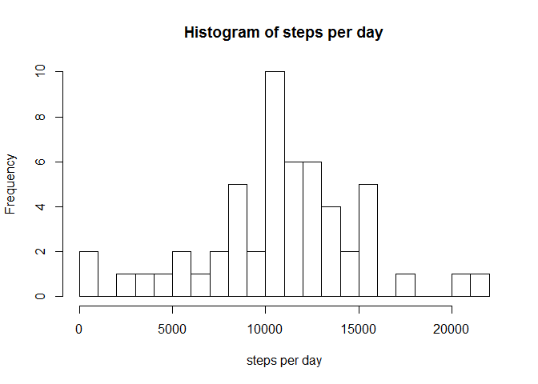
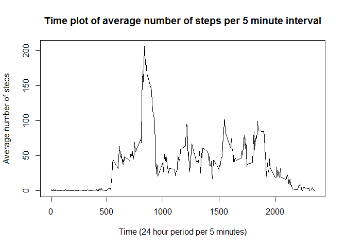
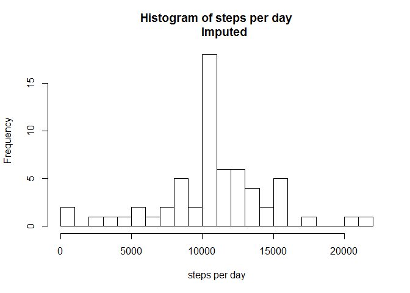
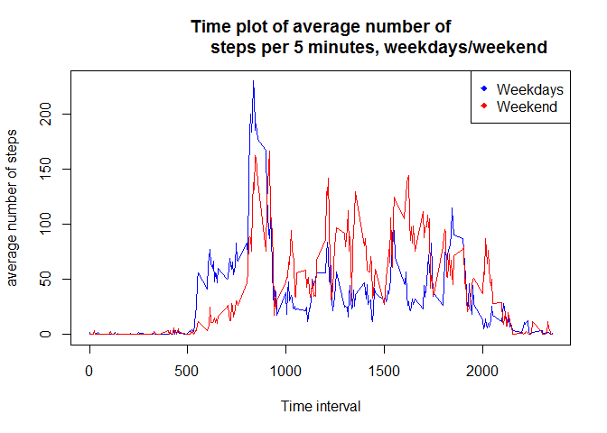

# Reproducible Research: Peer Assessment 1

## by JP Kuijper

In this project data from a personal activity monitoring device is processed and
explored in different steps. 

### Dataset information

We make us of data from a personal activity monitoring device. The data consists
of two months of data from an anonymous individual collected during the months of
October and November, 2012 and include the number of steps taken in 5 minute
intervals each day.

The dataset can be found here: [Activity monitoring data](https://d396qusza40orc.cloudfront.net/repdata%2Fdata%2Factivity.zip)

The variables included in this dataset are:

1. steps: Number of steps taking in a 5-minute interval (missing values are coded as NA)
2. date: The date on which the measurement was taken in YYYY-MM-DD format
3. interval: Identifier for the 5-minute interval in which measurement was taken

The dataset is stored in a comma-separated-value (CSV) file and there are a total of 17,568 observations in this dataset.

### Loading and preprocessing the data

First we load dplyr from the library for the later processing, download the zip-
file, unzip and load the csv file. 


```r
library(dplyr)

temp <- tempfile()
download.file("https://d396qusza40orc.cloudfront.net/repdata%2Fdata%2Factivity.zip",
              temp, mode = "wb")
unz(temp, "activity.zip")
Activity <- read.csv(unz(temp, "activity.csv"), header = TRUE)

unlink(temp)
```

### What is mean total number of steps taken per day?

While ignoring the missing data, for now, we calculate the total number of steps
per day, make a histogram of this, and lastly report the mean and median of the
total steps per day. 


```r
ActivityDate <- Activity %>% group_by(date) %>% summarise_each(funs("sum"), 
                vars = steps)
```

Now that we have created a new datasets with the total number of steps per day,
we can create a histogram to get a better picture of the daily activity frequency.


```r
hist(x = ActivityDate$vars, breaks = 20, main = "Histogram of steps per day",
     xlab = "steps per day")
```

<!-- -->

For more clarity, we will calculate the mean and median. 

```r
mean(ActivityDate$vars, na.rm = TRUE) 
```

```
## [1] 10766.19
```

```r
median(ActivityDate$vars, na.rm = TRUE)
```

```
## [1] 10765
```

### What is the average daily activity pattern?

We explore the daily activity pattern, on average, by creating a time plot, and 
then by calculating which 5 minute interval contains the maximum number of steps.


```r
ActivityTime <- Activity[complete.cases(Activity$steps),]
ActivityTime <- ActivityTime %>% group_by(interval) %>% summarise_each(funs("mean"),
                vars = steps)
```

Now we will create the time series plot which will show when the highest average
number of steps takes place.


```r
plot(x = ActivityTime$interval, y = ActivityTime$vars, type = "l", 
     main = "Time plot of average number of steps per 5 minute interval", xlab = 
         "Time (24 hour period per 5 minutes)", ylab = "Average number of steps")
```

<!-- -->

Because we cannot, with certainty, say when the highest number of steps occurs.
We now calculate this number and its matching interval. 


```r
filter(ActivityTime, vars == max(vars))
```

```
## # A tibble: 1 × 2
##   interval     vars
##      <int>    <dbl>
## 1      835 206.1698
```

### Imputing missing values

We will explore the number of missing values, impute the missing values, and then
explore the total number of steps per day as before, comparing the answers with 
and without the imputing by recreating the histogram, mean and median. 


```r
sum(is.na(Activity$steps))
```

```
## [1] 2304
```

As can be seen there is a fair amount of missing values, and therefore imputing is necessary. 

As an imputing strategy the mean of the 5 minute interval will be used. This is
deemed as most fair due to the (in)activity at specific intervals. For example, 
at 3.00 am, it is fairly certain that no activity has been measured, while at
4.00 pm we expect more activity. The mean of the 5 minute intervals have already
been calculated and used in the last analysis.


```r
Activity1 <- Activity
Activity1 <- merge(Activity1, ActivityTime, by = "interval")
Activity1 <- arrange(Activity1, date)

Activity1$steps2 <- ifelse(is.na(Activity1$steps), Activity1$steps2 <- Activity1$vars,
       Activity1$steps2 <- Activity1$steps)
```

Now we will explore the differences between the imputed dataset with the non-
imputed by recreating the histogram, mean and median.


```r
ActivityDate1 <- Activity1 %>% group_by(date) %>% summarise_each(funs("sum"), 
                                                               vars = steps2)

hist(x = ActivityDate1$vars, breaks = 20, main = "Histogram of steps per day
     Imputed", xlab = "steps per day")
```

<!-- -->

```r
mean(ActivityDate1$vars)
```

```
## [1] 10766.19
```

```r
median(ActivityDate1$vars)
```

```
## [1] 10766.19
```
As can be seen, the median shows a small difference with before and the
histogram peak is higher. 

### Are there differences in activity patterns between weekdays and weekends?

We will explore the differences between weekdays and weekends by creating a new
factor variable based on the given dates. After that we will again make a time 
plot looking at the 5 minute intervals of the average number of steps. But this 
time we will look at the difference between during the week and the weekend.

First we will create a new factor variable, WeekEnd. The dataset with the imputed
missing values will be used.

```r
Activity1Week <- mutate(Activity1, weekdays = weekdays(as.POSIXct(date)))
Weekdays <- c("Monday", "Tuesday", "Wednesday", "Thursday", "Friday")

Activity1Week$WeekEnd <- factor((weekdays(as.POSIXct(Activity1$date)) %in% Weekdays), levels = c(FALSE, TRUE), labels = c("Weekend", "Weekday"))
```

Now we will create a new time series plot by looking at the 5 minute intervals
of the average number of steps, separated by weekdays and weekends.


```r
Activity1Week1 <- Activity1Week %>% group_by(interval, WeekEnd) %>% summarise_each(funs(
    "mean"), vars = steps2)

with(Activity1Week1, plot(interval, vars, main = "Time plot of average number of
                          steps per 5 minutes, weekdays/weekend", type = "n",
     ylab = "average number of steps", xlab = "Time interval"))
with(subset(Activity1Week1, WeekEnd == "Weekday"), points(interval, vars, 
                                                col = "blue", type = "l"))


with(subset(Activity1Week1, WeekEnd == "Weekend"), points(interval, vars, 
                                                col = "red", type = "l"))
legend("topright", pch = 18, col = c("blue", "red"), 
       legend = c("Weekdays", "Weekend"))
```

<!-- -->
